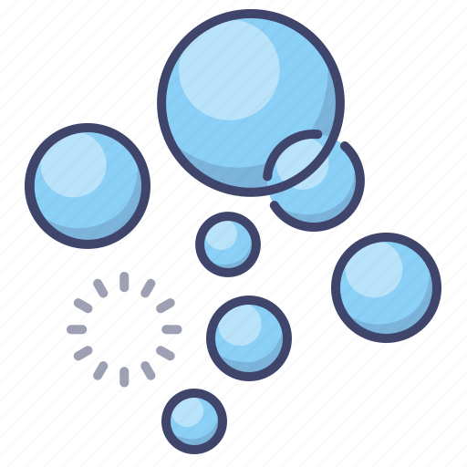
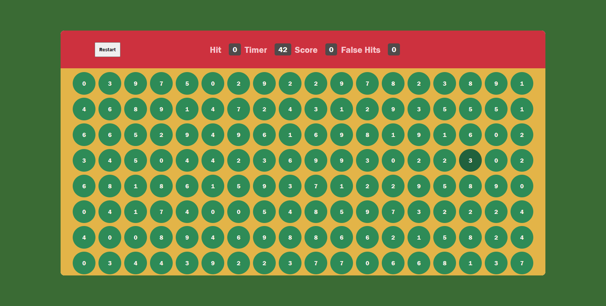

<h2>About the project</h2>

This is my 1 out of 3 mini game project to understand basic logics and better understanding. Every single letter is without any peaking.

Credits for the design goes to <a href='[https://github.com/Abderraouf-Rahmani](https://www.youtube.com/@thesheryianscodingschool)'>Sheriyans</a>

<h3>Build with:</h3>

» HTML  
» CSS  
» JS

<h2>Screenshots of the Project 📸</h2>
 
<h3 align='center'>Home Page 🏡</h3>

